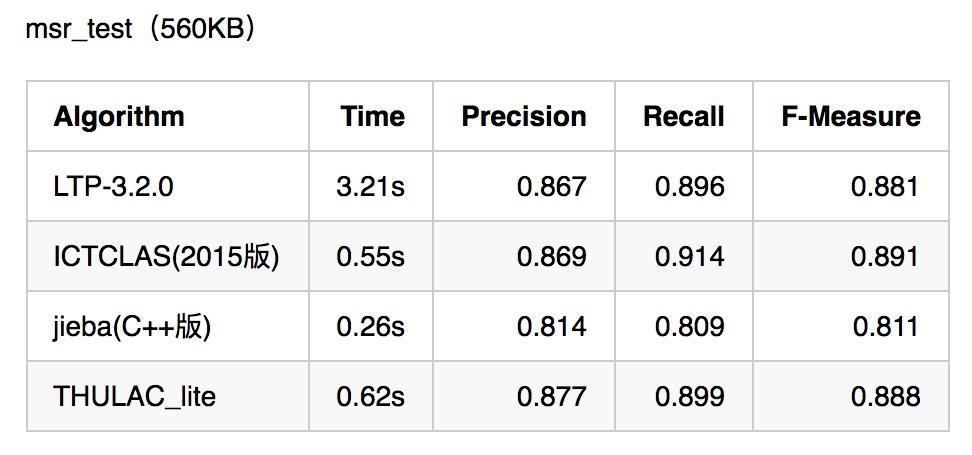
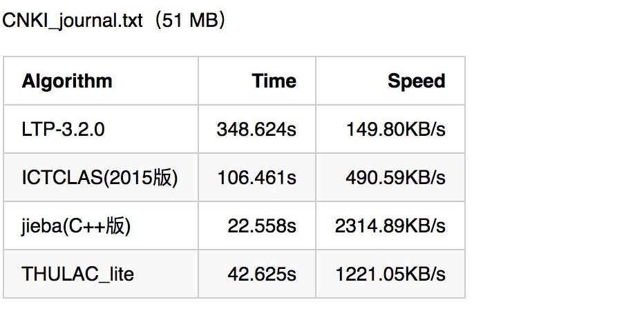

# **2.中文分词难点**

中文分词不像英文那样，天然有空格作为分隔。而且中文词语组合繁多，分词很容易产生歧义。中文分词难点主要集中在**分词标准，切分歧义和未登录词**三部分。

### 2.2 **切分歧义**

不同的切分结果会有不同的含义，分词粒度不同导致的不同切分结果。在文本分类，情感分析等文本分析场景下，粗粒度划分较好。而在搜索引擎场景下，细粒度的划分则较好。

1. **组合型歧义**：也称“固有型歧义”，有时候汉字串AB中，AB A B可以同时成词。比如“他/将/来/网商银行”，“他/将来/想/应聘/网商银行”。这需要通过整句话来区分。
2. **交集型歧义**：也称“偶发型歧义”，不同切分结果共用相同的字。比如“商务处/女干事”，“商务/处女/干事”。这也需要通过整句话来区分。
3. **真歧义**：本身语法或语义没有问题，即使人工切分也会产生歧义。比如“下雨天/留客天/天留/人不留”，“下雨天/留客天/天留人不/留”。此时只能通过上下文语境来进行切分。

有统计显示，中文文本中的切分歧义出现频次为1.2次/100汉字，其中**交集型歧义和组合型歧义占比为12：1**。而对于真歧义，一般出现的概率不大。

### 2.3 **未登录词**

未被词典收录的词，分为：新出现的词汇，比如一些网络热词；专有名词，主要是人名、地名、组织机构；专业名词和研究领域词语；其他专有名词，比如新出现的电影名、产品名、书籍名等。

**未登录词对于分词精度的影响远远超过歧义切分**。**未登录词识别难度也很大**，主要原因有

1. 未登录词**增长速度往往比词典更新速度快很多**，因此很难利用更新词典的方式解决未登录词问题。
2. 未登录词**没有明显的边界标志词。**
3. 未登录词有可能与其他词汇构成**交集型歧义**。
4. 未登录词中可能**夹杂着英语字母等其他符号**。

对于词典中不包含的未登录词，无法基于字符串匹配来进行识别。此时**基于统计的分词算法就可以大显身手了**，**jieba分词采用了HMM隐马尔科夫模型和viterbi算法来解决未登录词问题**

## **3.中文分词算法**

当前的分词算法主要分为两类，**基于词典的规则匹配方法**，和**基于统计的机器学习方法**。

### **3.1 基于词典的分词算法**

基于词典的分词算法，本质上就是**字符串匹配**。将待匹配的字符串和一个足够大的词典进行字符串匹配，如果匹配命中则可分词。根据不同的匹配策略分为**最大匹配法，全切分路径选择**等。

**最大匹配法**主要分为三种，但这类方法会产生歧义问题，比如“他将来上海”，会被划分为“他/将来/上海”：

1. **正向最大匹配法**，从左到右对语句进行匹配，匹配的词在字典中越长越好。
2. **逆向最大匹配法**，从右到左对语句进行匹配，匹配的词在字典中越长越好。
3. **双向匹配分词**，则同时采用正向最大匹配和逆向最大匹配，选择二者分词结果中**词数较少者**。

**全切分路径选择**，将所有可能的切分结果全部列出来，从中选择最佳的切分路径。

1. **n最短路径方法**，将所有的切分结果组成有向无环图，切词结果作为节点，词和词之间的边赋予权重，找到权重和最小的路径。比如可以通过词频作为权重，找到一条总词频最大的路径。
2. **n元语法模型**，采用n最短路径，只不过路径构成时会考虑词的上下文关系。一元表示考虑词的前后一个词，二元则表示考虑词的前后两个词。

### **3.2 基于统计的分词算法**

基于统计的分词算法，本质上是一个序列标注问题。将语句中的字，**按照他们在词中的位置进行标注**。标注主要有：B（词开始的一个字），E（词最后一个字），M（词中间的字，可能多个），S（一个字表示的词）。例如“网商银行是蚂蚁金服微贷事业部的最重要产品”，标注后结果为“BMMESBMMEBMMMESBMEBE”，对应的分词结果为“网商银行/是/蚂蚁金服/微贷事业部/的/最重要/产品”。这类算法基于机器学习或者现在火热的深度学习，主要有HMM，CRF，以及深度学习等。

1. **HMM，隐马尔科夫模型**。隐马尔科夫模型在机器学习中应用十分广泛，它包含观测序列和隐藏序列两部分。对应到NLP中，语句是观测序列，而序列标注结果是隐藏序列。任何一个HMM都可以由一个五元组来描述：观测序列，隐藏序列，隐藏态起始概率，隐藏态之间转换概率（转移概率），隐藏态表现为观测值的概率（发射概率）。其中起始概率，转移概率和发射概率可以通过大规模语料统计来得到。从隐藏态初始状态出发，计算下一个隐藏态的概率，并依次计算后面所有的隐藏态转移概率。序列标注问题就转化为了求解概率最大的隐藏状态序列问题。**jieba分词中使用HMM模型来处理未登录词**问题，并利用viterbi算法来计算观测序列（语句）最可能的隐藏序列（BEMS标注序列）。
2. **CRF，条件随机场**。也可以描述输入序列和输出序列之间关系。只不过它是基于条件概率来描述模型的。
3. **深度学习**。将语句作为输入，分词结果作为标注，可以进行有监督学习。

## **4.分词质量和性能**

中文分词对于自然语言处理至关重要，评价一个分词引擎性能的指标主要有分词准确度和分词速度两方面。下图为几种常用分词引擎在准确度和速度方面的对比。由图可见，想要做准确度很高的通用型分词引擎是多么的困难。如果对准确度要求很高，可以尝试开发特定领域的分词引擎。同时从图中可见，作为一款开源的通用型分词引擎，jieba分词的准确度和速度都还是不错的。

