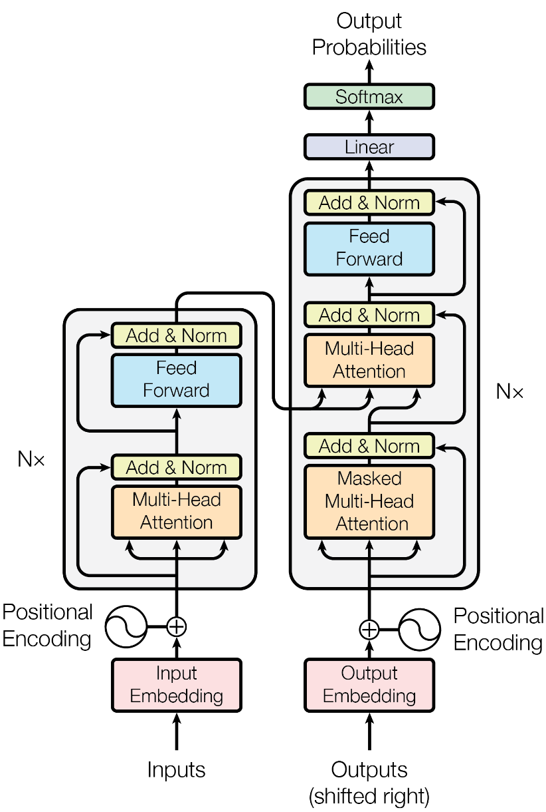

# Transformer 架构细节



## 1. Transformer 各个模块的作用

### （1）Encoder 模块

- 经典的 Transformer 架构中的 Encoder 模块包含6个 Encoder Block。
- 每个 Encoder Block 包含两个⼦模块, 分别是多头⾃注意⼒层, 和前馈全连接层。
  - 多头⾃注意⼒层可以在更细致的层⾯上提取不同 head 的特征, ⽐单⼀ head 提取特征的效果更佳。
  - 前馈全连接层是由两个全连接层组成, 线性变换中间增添⼀个Relu激活函数, 具体的维度采⽤4倍关系, 即多头⾃注意⼒的d\_model=512, 则层内的变换维度d\_ff=2048。

### （2）Decoder 模块

- 经典的 Transformer 架构中的 Decoder 模块包含6个 Decoder Block。
- 每个Decoder Block包含3个⼦模块, 分别是带掩码的多头⾃注意⼒层, 交叉注意力层, 和前馈全连接层。
  - 交叉注意力层和其他多头⾃注意⼒层最主要的区别在于Q != K = V,  矩阵Q来源于上⼀层 Decoder Block 的输出, 同时K, V来源于 Encoder 端的输出。

### （3）Add & Norm 模块

- Add 表示残差连接, 作⽤为了将信息⽆损耗的传递的更深, 来增强模型的拟合能⼒。
- Norm 表示 LayerNorm, 层级别的数值标准化操作, 作⽤是防⽌参数过⼤过⼩导致的学习过程异常 , 加速模型收敛。

### （4）位置编码器 Positional Encoding

- Transformer 中采⽤三⻆函数（sinusoid）来计算位置编码。
- 三⻆函数是周期性函数, 不受序列⻓度的限制, 且可以对序列中不同位置的编码重要程度同等看待。

## 2. Decoder 端训练和预测的输入

1. 在**训练阶段**, 每⼀个 time step 的输⼊是上⼀个 time step 的输⼊加上其在真实标签的后一位。真实代码实现中, 采⽤ MASK 机制来模拟输⼊序列不断添加的过程。

```text
   假设现在的真实标签序列等于"How are you?", 
   当time step=1时, 输⼊张量为⼀个特殊的token, ⽐如"SOS"; 
   当time step=2时, 输⼊张量为"SOS How"; 
   当time step=3时, 输⼊张量为"SOS How are";
   以此类推...
```

3. 在**预测阶段**, 每⼀个 time step 的输⼊是上⼀个 time step 的输⼊和预测结果的拼接张量。

```纯文本
   当time step=1时, 输⼊的input_tensor="SOS", 预测出来的输出值是output_tensor="What";
   当time step=2时, 输⼊的input_tensor="SOS What", 预测出来的输出值是output_tensor="is";
   当time step=3时, 输⼊的input_tensor="SOS What is", 预测出来的输出值是output_tensor="the";
   当time step=4时, 输⼊的input_tensor="SOS What is the", 预测出来的输出值是output_tensor="matter";
   当time step=5时, 输⼊的input_tensor="SOS What is the matter", 预测出来的输出值是output_tensor="?";
   当time step=6时, 输⼊的input_tensor="SOS What is the matter ?", 预测出来的输出值是output_tensor="EOS", 代表句⼦的结束符.

```

## 3. Self-attention

### （1）self-attention 的机制和原理

Attention 机制可以**直接跨越⼀句话中不同距离的 token, 远距离的学习到序列的知识依赖和语序结构**。Self-attention 中 Q = K = V。

### （2）self-attention 中归⼀化的作用

假设 $q$ 和 $k$ 中的元素是满⾜标准正态分布的独⽴随机变量，那么 $q\cdot k$ 的结果满足均值为 0, ⽅差为 $d_k$ 的正态分布，将点积缩放 $\frac{1}{\sqrt(d_k)}$ 可以**维持输出结果的分布依然是标准正态分布**。否则，随着词嵌⼊维度 $d_k$ 的增⼤，$q\cdot k$ **点积后的结果也会增⼤**，在训练时使用 softmax 会**导致梯度消失**；见（3）。

### （3）softmax 的梯度消失问题

首先，定义神经网络的输入和输出：设 $X=[x_1,x_2,..., x_n]$，$Y=\mathrm{softmax}(X)=[y_1, y_2,..., y_3]$，shape 为 (1,n)。假设 $X$ 中最⼤的分量下标是 $k$, 不难证明在 $x_k$ 较⼤时，softmax ⼏乎将全部的概率分布都分配给了 $k$ 对应的标签，即有
$$\lim_{x_k\longrightarrow+\infty}\mathrm{softmax}(x_i)=\delta_{i,k}$$

其次，考虑梯度，通过简单的计算可以得到，$\partial_{x_i} y_i = y_i-y_i\cdot y_i$ 与  $\partial_{x_j} y_i = 0-y_{i} \cdot y_{j}$（$i\neq j$），即
$$\frac{\partial Y}{\partial X}=\mathrm{diag}(Y)-Y^T\cdot Y$$

不失一般性，假设输入 $X$ 的最大分量为 $x_1$。当 ${x_1\longrightarrow+\infty}$ 时，所有的梯度都消失为 0, 参数几乎无法更新, 模型收敛困难：
$$
\begin{aligned}
\frac{\partial Y}{\partial X} &= \left[\begin{array}{cccc}
y_{1} & 0 & \cdots & 0 \\
0 & y_{2} & \cdots & 0 \\
\vdots & \vdots & \ddots & \vdots \\
0 & 0 & \cdots & y_{d}
\end{array}\right]-\left[\begin{array}{cccc}
y_{1}^{2} & y_{1} y_{2} & \cdots & y_{1} y_{d} \\
y_{2} y_{1} & y_{2}^{2} & \cdots & y_{2} y_{d} \\
\vdots & \vdots & \ddots & \vdots \\
y_{d} y_{1} & y_{d} y_{2} & \cdots & y_{d}^{2}
\end{array}\right]\\
&\longrightarrow \left[\begin{array}{cccc}
1 & 0 & \cdots & 0 \\
0 & 0 & \cdots & 0 \\
\vdots & \vdots & \ddots & \vdots \\
0 & 0 & \cdots & 0
\end{array}\right]-\left[\begin{array}{cccc}
1 & 0 & \cdots & 0 \\
0 & 0 & \cdots & 0 \\
\vdots & \vdots & \ddots & \vdots \\
0 & 0 & \cdots & 0
\end{array}\right]=0
\end{aligned}
$$

## 5. Multi-head Attention

### （1）采⽤Multi-head Attention的原因

1. 原论⽂中提到的原因是将模型分为多个头, **可以形成多个子空间, 让模型关注不同方面的信息**。
2. 不同的头提取不同的特征，直观上讲，**有助于神经网络捕捉到更丰富的特征信息**。

### （2）Multi-head Attention 的计算⽅式

1. 首先，对特征张量的最后⼀个维度（模型维度/词嵌入维度）进行分割，比如，embedding\_dim=512 切割成 head=8, 这样每⼀个 head 的嵌⼊维度就是 512/8=64。
2. 在每个头上分别进⾏注意⼒规则的运算后, 简单采用拼接 **concat** 的⽅式对结果张量进⾏融合。
3. 最后，再**通过一个单层线性层**，就得到了 Multi-head Attention 的计算结果。

### 6. LayerNorm VS BatchNorm

采用 **LayerNorm**，和 **BatchNorm** 的区别主要是做归一化的维度不同，假设一个输入 $X$ 的 shape 为 (batch_size, feature_dim)

- **BatchNorm** 针对一个 batch 里**所有数据**在**相同特征上** $X[:,j]$ 进行归一化；
- **LayerNorm** 针对一个 batch 里**单个样本的数据**在**不同特征上** $X[i,:]$ 进行归一化。

BatchNorm 的缺点：

1. 需要较大的 batch 以体现整体数据分布；
2. 训练阶段需要保存每个 batch 的均值和方差，以求出整体均值和方差在 infrence 阶段使用；
3. 不适用于可变长序列的训练。

LayerNorm 的优点：计算独立于 batch，从而解决 BatchNorm 导致的两个问题，且适用于可变长序列的训练。但在大批量的样本训练时，效果没 BN 好。

## 7. FFN 的作用

- 增强模型的特征提取能力；
- FFN 中的激活函数为模型提供非线性变换来源（**Transformer 非线性的来源**：FNN 的激活函数；Attention 中的 softmax）。


## 8. Transformer 和传统序列模型的对比

1. Transformer 的第⼀⼤优势是强⼤的**并⾏计算能力**：传统序列模型任意时刻的输⼊大多都依赖于上⼀时刻的隐藏层输出，无法实现并行计算。而 Transformer 的 self-attention 层则可以实现并⾏运算。
2. Transformer 的第⼆⼤优势是强⼤的**特征抽取能力**：⼤量的试验数据和对⽐结果证明了使用 Multi-head Attention 结构的 Transformer 拥有⽐传统序列模型更强⼤的特征抽取能⼒。

## 9. Transformer 并行化

**Transformer 架构中 Encoder 模块的并行化机制**
- **Encoder模块在训练阶段和测试阶段都可以实现完全相同的并行化。**
- Encoder模块在 Embedding 层，Feed Forward 层，Add & Norm 层都是可以并行化的。
- Encoder模块在 self-attention 层，因为各个 token 之间存在依赖关系，无法独立计算，不是真正意义上的并行化。但由于采用了矩阵运算的实现方式，可以一次性的完成所有注意力张量的计算，也是另一种"并行化"的体现。

**Transformer 架构中 Decoder 模块的并行化机制**
- **Decoder模块在训练阶段可以实现并行化**。
- Decoder 模块在训练阶段的 Embedding 层，Feed Forward 层，Add & Norm 层都是可以并行化的。
- Decoder 模块在 self-attention 层，以及 Encoder-Decoder Attention 层，因为各个 token 之间存在依赖关系，无法独立计算，不是真正意义上的并行化。但由于采用了矩阵运算的实现方式，可以一次性的完成所有注意力张量的计算，也是另一种"并行化"的体现。
- **Decoder模块在预测计算不能并行化处理。**
