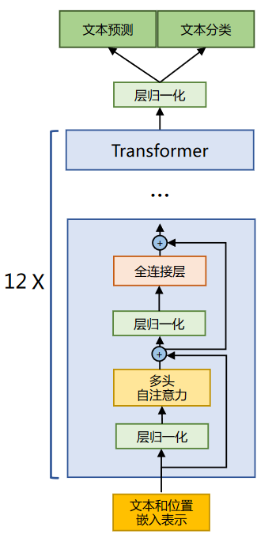
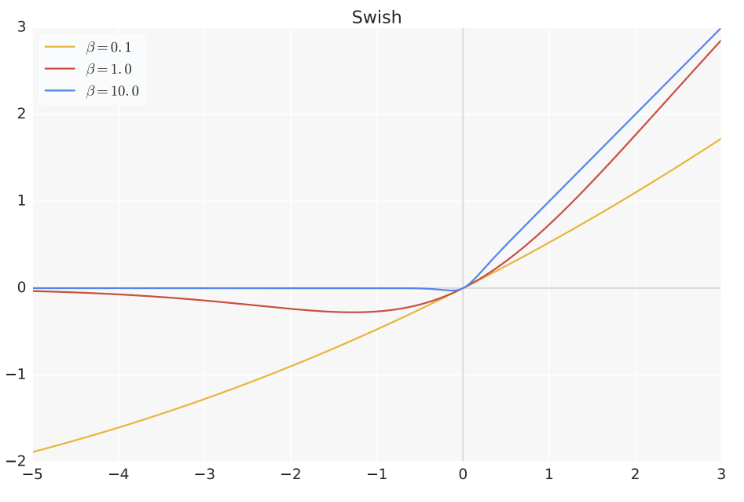
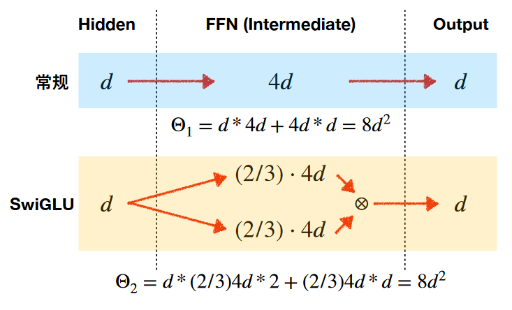
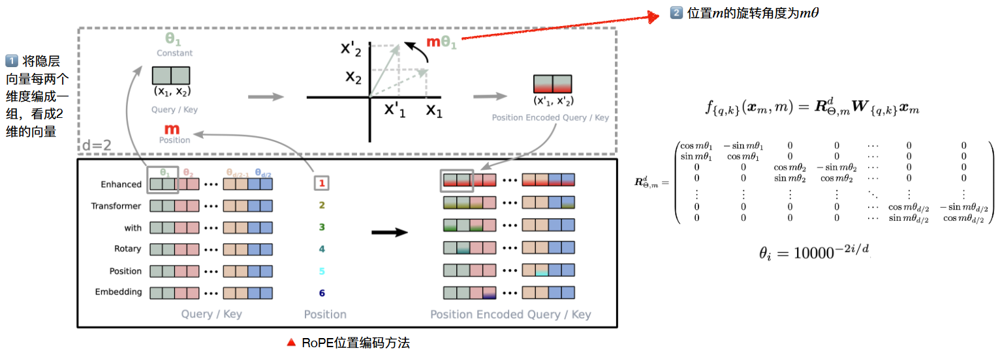
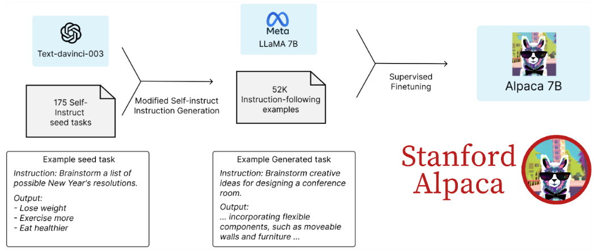
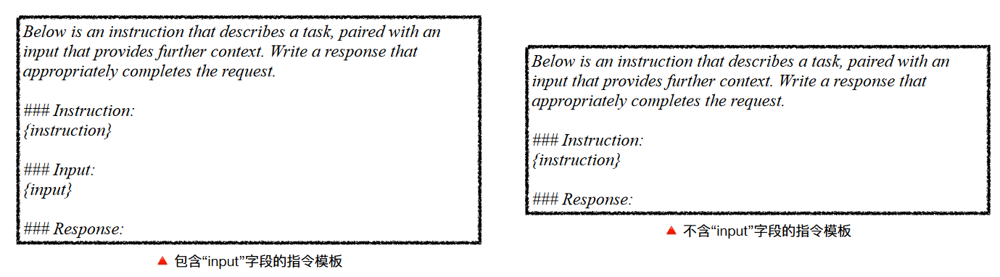
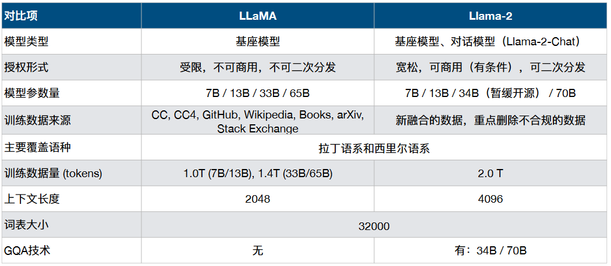
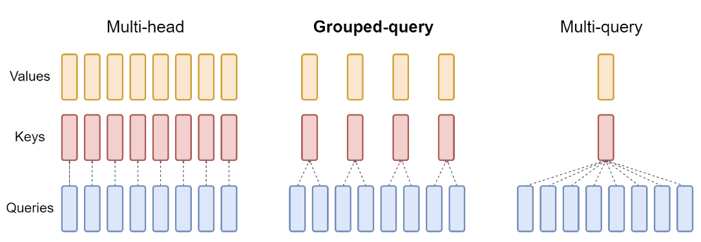

# 1. LLaMA

2023 年 2 月，Meta 推出了 LLaMA 大模型（Large Language Model Meta AI），使用了 1.4T token 进行训练，虽然最大模型只有65B，但在相关评测任务上的效果可以媲美千亿级模型。LLaMA 所采用的 Transformer 结构和细节，与标准的 Transformer 架构不同的地方包括
- 采用了前置层归一化 **Pre-LN** 并使用 **RMSNorm** 归一化函数；
- 激活函数更换为 **SwiGLU**；
- 取消了词嵌入阶段的绝对位置编码，改为在注意力计算前直接对`q, k`进行旋转位置嵌入 **RoPE** 进行相对位置编码。

<div align="center">

</div>

## 1.1 RMSNorm 归一化函数

**为了使得模型训练过程更加稳定**，LLaMA 沿用 GPT-2 的**前置层归一化方法**。层归一化中采用了**平方均值归一化**函数 **RMSNorm** (Root Mean Square Norm)，针对输入向量 RMSNorm 函数计算公式如下

$$
\bar{a}_{i}=\frac{a_{i}}{RMS(\boldsymbol{a})}\ \ \mathrm{where}\ \ RMS(\boldsymbol{a})=\sqrt{\frac{1}{n} \sum_{i=1}^{n} a_{i}^{2}}
$$

此外，RMSNorm 还可以引入可学习的缩放因子 $g_
i$ 和偏移参数 $b_i$，从而得到 $\bar{a}_{i}=\frac{a_{i}}{\operatorname{RMS}(\boldsymbol{a})} g_{i}+b_{i}$。 RMSNorm 在 HuggingFace Transformer 库中代码实现如下所示：

```python
class LLaMARMSNorm(nn.Module):
  def __init__(self, hidden_size, eps=1e-6): 
    """ 
    LLaMARMSNorm is equivalent to T5LayerNorm 
    """ 
    super().__init__() 
    self.weight = nn.Parameter(torch.ones(hidden_size)) 
    self.variance_epsilon = eps # eps 防止取倒数之后分母为 0 
  
  def forward(self, hidden_states): 
    input_dtype = hidden_states.dtype 
    variance = hidden_states.to(torch.float32).pow(2).mean(-1, keepdim=True) 
    hidden_states = hidden_states * torch.rsqrt(variance + self.variance_epsilon) # weight 是末尾乘的可训练参数, 即 g_i 
    
    return (self.weight * hidden_states).to(input_dtype)
```

## 1.2 SwiGLU 激活函数

SwiGLU 激活函数是相较于 ReLU 函数在大部分评测中都有不少提升。在 LLaMA 中全连接层使用带有 SwiGLU 激活函数的 FFN 的计算公式如下：

$$
\operatorname{FFN}_{\text {SwiGLU }}\left(\boldsymbol{x}, \boldsymbol{W}, \boldsymbol{V}, \boldsymbol{W}_{2}\right)=\operatorname{SwiGLU}(\boldsymbol{x}, \boldsymbol{W}, \boldsymbol{V}) \boldsymbol{W}_{2}
$$

$$
\operatorname{SwiGLU}(\boldsymbol{x}, \boldsymbol{W}, \boldsymbol{V})=\operatorname{Swish}_{\beta}(x \boldsymbol{W}) \odot \boldsymbol{x} \boldsymbol{V}
$$

$$
\operatorname{Swish}_{\beta}(\boldsymbol{x})=\boldsymbol{x} \sigma(\boldsymbol{\beta} \boldsymbol{x})
$$

其中，$σ(x)$ 是 Sigmoid 函数。下图给出了 Swish 激活函数在参数 $β$ 不同取值下的形状。可以看 到当 $β$ 趋近于 0 时，Swish 函数趋近于线性函数 $y = x$，当 $β $趋近于无穷大时，Swish 函数趋近于 ReLU 函数，$β$ 取值为 1 时，Swish 函数是光滑且非单调。LLaMA 中直接将 FFN 中的 ReLU 替换为 SwiGLU，并将隐层维度放缩为$(2/3) ⋅ 4d$。

<div align="center">


</div>


## 1.3 旋转位置嵌入 RoPE



在位置编码上，使用旋转位置嵌入（Rotary Positional Embeddings，RoPE）代替原有的绝对位置编码。将待编码的嵌入向量 $\boldsymbol{q}\in\mathbb{R}^{d}$ 每两个元素视为一组（$d$ 为偶数），先考虑最简单的情况，$d=2$，我们知道旋转变换

$$
f(\boldsymbol{q}, m)=\left(\begin{array}{cc}\cos m \theta & -\sin m \theta \\ \sin m \theta & \cos m \theta\end{array}\right)\left(\begin{array}{l}{q}_{0} \\ {q}_{1}\end{array}\right) = (q_0+q_1i)e^{im \theta}
$$

表示让二维向量逆时针旋转角度 $m \theta$。对于 $d>2$ 的情况，取 $\theta_i=10000^{-2i/d}$，第 $m$ 个词向量 $\boldsymbol{q}$ 对应的位置编码变换 $f(\boldsymbol{q}, m)$ 定义为：

$$
f(\boldsymbol{q}, m)=\underbrace{\left(\begin{array}{ccccccc}\cos m \theta_{0} & -\sin m \theta_{0} & 0 & 0 & \cdots & 0 & 0 \\ \sin m \theta_{0} & \cos m \theta_{0} & 0 & 0 & \cdots & 0 & 0 \\ 0 & 0 & \cos m \theta_{1} & -\sin m \theta_{1} & \cdots & 0 & 0 \\ 0 & 0 & \sin m \theta_{1} & \cos m \theta_{1} & \cdots & 0 & 0 \\ \cdots & \cdots & \cdots & \cdots & \ddots & \cdots & \cdots \\ 0 & 0 & 0 & 0 & \cdots & \cos m \theta_{(d / 2)-1} & -\sin m \theta_{(d / 2)-1} \\ 0 & 0 & 0 & 0 & \cdots & \sin m \theta_{(d / 2)-1} & \cos m \theta_{(d / 2)-1}\end{array}\right)}_{{R}_{d}}\left(\begin{array}{c}{q}_{0} \\ {q}_{1} \\ {q}_{2} \\ {q}_{3} \\ \cdots \\ {q}_{d-2} \\ {q}_{d-1}\end{array}\right)
$$

RoPE 在 HuggingFace Transformer 库中代码实现如下所示：

```python
def precompute_freqs_cis(dim: int, end: int, constant: float = 10000.0):
    '''
    :param dim: q, k, v 的最后一维，一般为 emb_dim / head_num
    :param end: 句长 length
    :param constant： 这里指 10000
    :return: 二维列表 freqs_cis[m][k] := cos(m*theta_k) + j*sin(m*theta_k)
    '''
    z = torch.arange(0, dim, 2)[:(dim//2)].float() / dim    # 2i/d, [d/2]
    freqs = 1.0 / (constant ** z)                           # theta, [d/2]
    t = torch.arange(end, device=freqs.device)              # m, [length]
    freqs = torch.outer(t, freqs).float()                   # t(m)*freqs(k), [length, d/2]
    freqs_cis = torch.polar(torch.ones_like(freqs), freqs)  # complex64, [length, d/2]
    return freqs_cis

def reshape_for_broadcast(freqs_cis: torch.Tensor, x: torch.Tensor):
    ndim = x.ndim
    assert 0 <= 1 < ndim
    assert freqs_cis.shape == (x.shape[1], x.shape[-1])
    shape = [d if i == 1 or i == ndim - 1 else 1 for i, d in enumerate(x.shape)] # (1, length, 1, d/2)
    return freqs_cis.view(*shape) # [1, length, 1, d/2]

def apply_rotary_emb(xq: torch.Tensor, xk: torch.Tensor, freqs_cis: torch.Tensor,):
    # 先将 xq、xk 维度变为 [bs, length, head,  d/2, 2]，利用 torch.view_as_complex 转变为复数
    # xq:[q0, q1, .., q(d-1)] to xq_:[q0+j*q1, q2+j*q3, ..., q(d-2)+j*q(d-1)]；resp xk，xk_
    xq_ = torch.view_as_complex(xq.float().reshape(*xq.shape[:-1], -1, 2)) # [bs, length, head,  d/2]
    xk_ = torch.view_as_complex(xk.float().reshape(*xk.shape[:-1], -1, 2)) 
    freqs_cis = reshape_for_broadcast(freqs_cis, xq_) # [1, length, 1, d/2]

    # 下式xq_ * freqs_cis形式化输出，以第一个为例 (q0+j*q1) * (cos(m*theta_0) + j*sin(m*theta_0))
    # torch.view_as_real 取出实部和虚部，维度 [bs, length, head, d/2] -> [bs, length, head, d/2, 2]
    # flatten 将维度拉平，维度 [bs, length, head, d/2, 2] -> [bs, length, head, d]
    # xq_out 形式化为 [实部0，虚部0，实部1，虚部1，..., 实部(d/2-1), 虚部(d/2-1)] 为新生成的q
    xq_out = torch.view_as_real(xq_ * freqs_cis).flatten(3) \
    xk_out = torch.view_as_real(xk_ * freqs_cis).flatten(3)
    return xq_out.type_as(xq), xk_out.type_as(xk)

if __name__=='__main__':
    # (bs, length, head, d)
    q = torch.randn((2, 10, 12, 32))  
    k = torch.randn((2, 10, 12, 32))
    v = torch.randn((2, 10, 12, 32))
    freqs_cis= precompute_freqs_cis(dim=32, end=10, constant= 10000.0)
    q_new, k_new = apply_rotary_emb(xq=q, xk=k, freqs_cis=freqs_cis)
```

# 2. Alpaca

Alpaca 是在**LLaMA基础上使用52K指令数据精调的预训练模型**，作者只用了不到 600 美元的成本训练出了该模型。初步实验结果表明Alpaca 可以达到与 OpenAI text-davinci-003 相匹敌的效果。

## 2.1 微调方法

1. 第一步：构造 175 条 self-instruct 种子示例任务；
2. 第二步：基于上述种子任务，利用 text-davinci-003 生成更多指令数据；
3. 第三步：使用爬取下来的 52K 指令数据在 LLaMA 上进行精调，最终得到 Alpaca。



## 2.2 Self-instruct 数据构造与指令数据生成

首先由人工构造 175 条种子数据

```json
{
  "id": "seed_task_25", 
  "name": "perfect_numbers", 
  "instruction": "Find the four smallest perfect numbers.", 
  "instances": [{ "input": "", "output": "6, 28, 496, and 8128”}], 
  "is_classification": false
}
```

将“爬取要求”和种子数据进行适当组合，送入 textdavinci-003，要求生成类似的指令数据。要求包括：提升指令多样性、包含真实数据、字数 要求、语言要求、拒绝不合适指令等。生成指令包含

```json
{
  "instruction": "描述模型需要执行的指令内容",
  "input" : "任务上下文或输入信息，例如当指令是“对文章进行总结”，则input是文章内容",
  "output": "由text-davinci-003生成的针对指令的回复"
}
```



# 3. LLaMA-2

2023 年 7 月，Meta 推出了LLaMA-2 开源大模型，并且推出了LLaMA-2-Chat对话模型。与一代 LLaMA 主要区别体现在**更多的训练数据、更⻓的上下文窗口、GQA技术**等。



模型结构的变动主要是体现在 **GQA** 和 **FFN** 缩放上

- **MHA 改成 GQA**：整体参数量减少
- **FFN 模块矩阵维度有扩充**：增强泛化能力，整体参数量增加

GQA 和 MQA 都是注意力的变体，其中多个查询头关注相同的键和值头，以减少推理过程中 KV 缓存的大小，并可以显著提高推理吞吐量。

MHA、GQA、MQA的区别和联系，具体的优点如下：

- `Mutil-Head  Attention` 自回归模型生成回答时可以使用前面生成的 KV 缓存加速计算。
- `Multi-Query Attention` 多个头之间可以共享 KV 对加速，实验验证大约减少30-40%吞吐。
- `Group-Query Attention` 将 query 分组，组内共享 KV，效果接近MQA。

LLaMA-2 中使用了 8 个 KV 映射，即 GQA-8，**GQA 在多数任务上与 MHA 效果相当，且平均效果优于 MQA；GQA 和 MQA 均比 MHA 有更好的吞吐量**。




