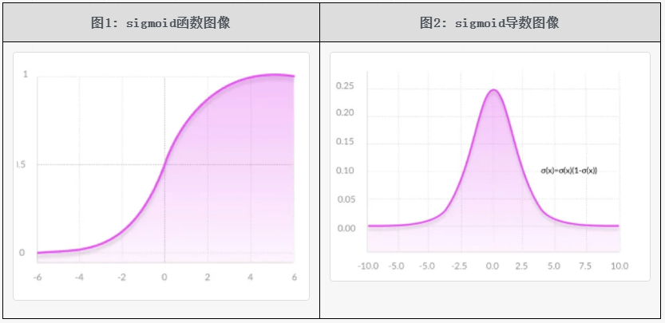
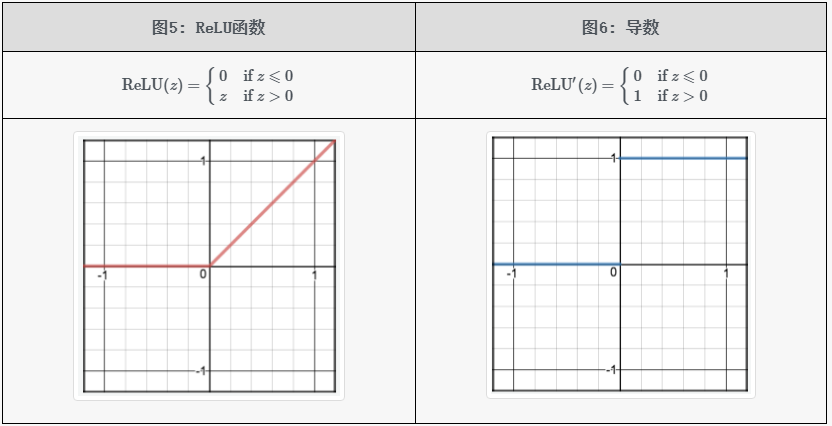
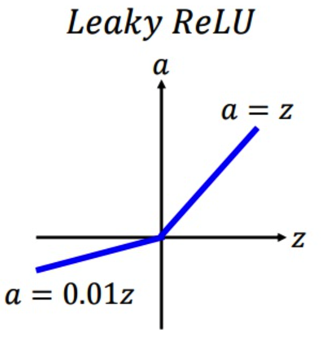
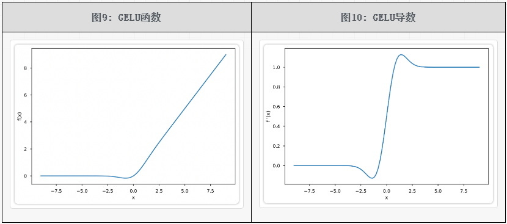
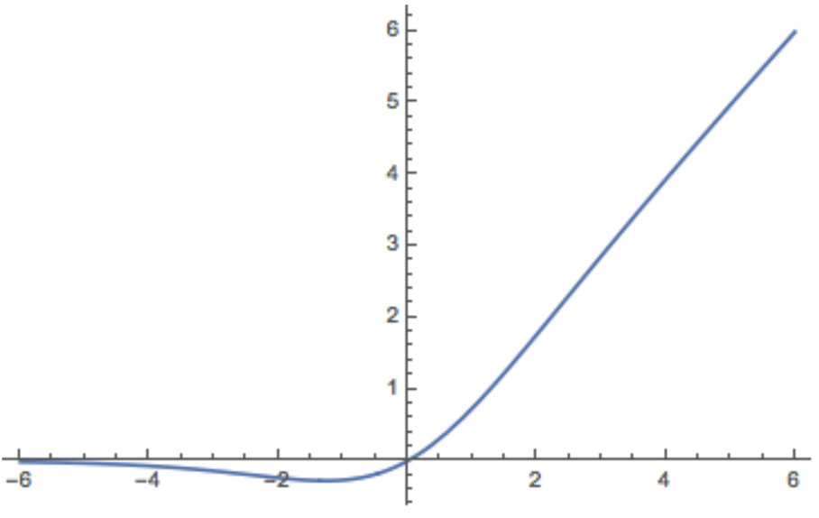

# 1.激活函数

### 1.激活函数作用

**神经网络是线性的，无法解决非线性的问题**，加入激活函数就是给模型引入非线性能力；不同的激活函数，特点和作用不同：

- `Sigmoid`和 `tanh`的特点是将输出限制在 `(0,1)` 和  `(-1,1)` 之间，说明 `Sigmoid`和 `tanh`适合做概率值的处理，例如LSTM中的各种门；而 `ReLU`就不行，因为 `ReLU`无最大值限制，可能会出现很大值。
- `ReLU`适合用于深层网络的训练，而 `Sigmoid`和 `tanh`则不行，因为它们会出现梯度消失。

### 2.梯度爆炸和梯度消失

1. 激活函数导致的梯度消失，像 `sigmoid `和 `tanh` 都会导致梯度消失，此时只需要使用像 ReLU 这种激活函数就可以解决；
2. 反向传播时，梯度会连乘，这个原因导致的梯度消失无法通过更换激活函数来避免；这个问题没有能够完全解决的方法，但目前有一些方法可以很大程度上进行缓解该问题，比如：**对梯度做截断解决梯度爆炸问题、残差连接、normalize**。由于使用了残差连接和 normalize 之后梯度消失和梯度爆炸已经极少出现了，所以目前可以认为该问题已经解决了。

### 3.Sigmoid

Sigmoid 函数公式：$\sigma(z)=\frac{1}{1+e^{-z}}$，导数公式：$\sigma^{\prime}(z)=\sigma(z)(1-\sigma(z))$

优点：平滑，易于求导；取值范围是 `(0, 1)`，可直接用于求概率值的问题或者分类问题。

缺点：**计算量大**，包含幂运算及除法运算；导数的取值范围是 `[0, 0.25]`，**很容易就会出现梯度消失的问题**；**sigmoid 输出的均值不是0**（即zero-centered），随着网络的加深会改变数据的原始分布。

### 4.Tanh

Tanh 的函数公式为：$\tanh (z) =\frac{e^{z}-e^{-z}}{e^{z}+e^{-z}} =\frac{2}{1+e^{-2 z}}-1$，导数公式 $\tanh^{\prime}(x)=[1-\tanh(x)][1+\tanh(x)]$。从上述第一个公式的第二个等号可以看出，tanh 函数可以由 sigmoid 函数经过平移和拉伸得到。tanh 函数的取值范围是 `（-1, 1）`。

tanh 函数可以理解为是**基于 sigmoid 函数的一种改进的激活函数**，所以对于 sigmoid 函数的缺点，它能够解决一部分。tanh 函数的特点如下：

- **幂运算依然存在，计算量比较大**。
- 它的输出范围是 `(-1, 1)`，解决了 sigmoid 函数输出不是 zero-centered 的问题；
- tanh 的导数取值范围是 `(0, 1)`，可以看出其在反向传播过程中存在着梯度消失问题；

### 5.ReLU系列

#### 5.1 ReLU

`ReLU `全称为 Rectified Linear Unit，即修正线性单元函数。相应的公式和图像如下表所示。

相比于 `sigmoid`、`tanh `这两个激活函数，`ReLU `激活函数的优缺点如下：

- 计算复杂度低，不再含有幂运算，只需要一个阈值就能够得到其导数；
- 当 `z > 0` 时，ReLU 激活函数的导数恒为常数1，避免了深神经网络的梯度消失的问题；
- 实验发现，**使用 ReLU 作为激活函数，模型收敛的速度比 sigmoid 和 tanh 快**；
- 当 `z < 0`时，ReLU 激活函数的导数恒为常数0：
  - 优势：ReLU 激活函数中将 `z < 0` 的部分置为 0，导致网络每层的输出均具有一定的稀疏性。在深度学习中，这有利于提高模型的稳健性。
  - 劣势：将 `z < 0` 的部分梯度直接置为 0 会导致 Dead ReLU Problem 神经元坏死现象，**可能导致部分神经元不再被更新**。
- ReLU 有可能会导致**梯度爆炸**问题，解决方法是梯度截断；
- ReLU 的输出不是 zero-centered，（优化的 ELU 的输出是近似 zero-centered 的）。

#### 5.2 Leaky ReLU

为了解决 Dead ReLU 问题，提出了渗漏整流线性单元(Leaky ReLU)，该方法是 ReLU 的一个变体，能够在一定程度上解决 Dead ReLU 问题，但是该方法的缺点是**效果并不稳定**，所以实际实验中使用该方法的并不多。其公式如下，在 `z > 0` 的部分与 ReLU 一样保持不变；在 `z < 0` 的部分，采用一个非常小的斜率 0.01：

$$
\operatorname{LeakyReLU}(z)=\left\{\begin{array}{ll}0.01 z & \text { if } z \leqslant 0 \\ z & \text { if } z>0\end{array}\right.
$$

其图像如下所示：

#### 5.3 PReLU, RReLU

PReLU 的全称为 Parametric Relu；PReLU 的全称为 Random ReLU。这两个方法和 Leaky ReLU 类似，都是 ReLU 的变体。也都是为了解决 Dead ReLU 问题而提出来的。

Leaky ReLU 是在 `z < 0` 时，设置了一个较小的常数作为斜率。由于这种常数值的斜率并不好，所以 PReLU 提出了可学习的斜率，RReLU 提出了随机的斜率，两者具体的公式相同，

$$
\operatorname{(P/R)ReLU}(z)=\left\{\begin{array}{ll}\alpha \cdot z & \text { if } z \leqslant 0 \\ z & \text { if } z>0\end{array}\right.
$$

只不过 PReLU 的 $\alpha$ 是可学习的，RReLU 的 $\alpha$ 是从一个高斯分布中随机产生的。PReLU 和 RReLU 的图像如下所示：

#### 5.4 ELU（指数线性单元）

ELU 的提出也解决了 ReLU 的问题。与 ReLU 相比，ELU 有负值，这会使激活的平均值接近零，让模型学习得更快。

$$
\operatorname{ELU}(z)=\left\{\begin{array}{ll}\alpha\left(\mathrm{e}^{z}-1\right) & \text { if } z \leqslant 0 \\ z & \text { if } z>0\end{array}\right.
$$

其中 $\alpha$ 是可学习参数。
- 左侧不恒为 0，在一定程度上缓解 Dead ReLU 问题；
- 左侧软饱和性让 ELU 对输入变化或噪声更稳健，也提供更稳定的梯度流；
- 右侧线性部分使得 ELU 能够缓解梯度消失；
- ELU 的输出均值接近于 zero-centered，所以收敛速度更快；
- ELU 的一个小问题是需要 exp 计算，运算量更大。

所谓 **软饱和性（soft saturation）**，是指一种非线性激活函数在输入值趋向极端（特别是负方向）时，输出逐渐趋于一个有限的常数，但其导数不会突变为0，而是平缓衰减的现象。它是相对 **硬饱和** 而言的，后者指的是导数迅速变为0，导致梯度消失。

### 6.GeLU

出自2016年的论文《Gaussian Error Linear Units (GELUs)》。输入值用 $x$ 表示，$\Phi(⋅)$ 表示标准正态分布的 cdf，$\phi(z)$ 为标准正态分布的 pdf，GeLU 的公式表示如下
$$
\operatorname{G e L U}(z) =  z\cdot \Phi(z)
$$
其导数：
$$
\begin{aligned} \frac{d}{d z} \operatorname{G e L U}(z) =\Phi(z)+z \cdot \phi(z)\end{aligned}
$$

GeLU 函数及其导数的图像如下所示。可以看出其函数图像和 ReLU 非常相似，其导数图像也和 ReLU 的导数图像非常相似，不过该图像是连续的。GELU 激活函数的优点：
- 在负值区域不再全为 0，解决了 Dead ReLU 问题；
- GeLU 函数是处处连续、光滑可导的；
- 缺点是计算量大。

对于 GeLU 的加速计算有两种方法。第一种方法是**精确求解**。有一个函数为 (Gauss) Error function (erf)，由于使用率非常高所以在常见的库（比如TensorFlow、PyTorch）中都有针对该函数的优化，该函数的公式如下。

$$
\operatorname{erf}(z)=\frac{2}{\sqrt{\pi}} \int_{0}^{z} e^{-t^{2}} d t
$$

所以如果能够先求解出$\operatorname{erf}(\cdot)$，再由该函数求解出 $\phi(x)$，那么可以加快计算。下面省略具体的推导过程，直接给出计算公式：

$$
\Phi(z)=\frac{1+\operatorname{erf}\left(\frac{z}{\sqrt{2}}\right)}{2}
$$

另一种方法是近似求解。GeLU 的近似公式如下所示：

$$
\operatorname{G e L U}(z)=0.5 * z\left(1+\tanh \left[\sqrt{\frac{2}{\pi}}\left(z+0.044715 z^{3}\right)\right]\right)
$$

### 7.Swish

出自 2017 年的论文《Searching for Activation Functions》。记 Sigmoid 函数为 $\sigma(\cdot)$ Swish 激活函数公式为：$f(x)=x \cdot \sigma(x)$，导数为：$\begin{array}{l}f^{\prime}(x) =f(x)+\sigma(x) \cdot[1-f(x)]\end{array}$。Swish特点：

- 无上界，因此不会出现梯度饱和现象；
- 一方面，对负输入不会直接截断为0，而是输出一个压缩后的值，保留部分信息而不完全丢弃；另一方面，会“软性地关闭”一部分有极小负输入的神经元，产生类似 Dropout 的效果。总体上，Swish 可以产生更强的正则化效果；
- 处处连续且可导，更容易训练。

梯度饱和现象（Gradient Saturation）：指在使用某些激活函数（如 sigmoid 或 tanh）时，当神经元的输入非常大或非常小时，其导数变得非常接近零，导致反向传播时梯度几乎无法通过该神经元传播。

关于正则化效果：是指在深度学习中抑制模型过拟合、提升泛化能力的一种机制或现象。

### 8.GLU

PaLM 和 LLaMA 中都使用 SwiGLU 替换了 FFN。出自2017年的论文 [Language Modeling with Gated Convolutional Networks](https://arxiv.org/pdf/1612.08083.pdf "Language Modeling with Gated Convolutional Networks")。GLU 全称为 Gated Linear Unit，即**门控线性单元函数**。参考ReLU激活函数，激活函数 GLU 的公式为如下公式的形式

$$
\operatorname{GLU}(z)=z \odot \sigma(g(z))
$$

这里有一个新符号 $g(z)$ 表示的是向量 $z$ 经过一层MLP或者卷积，$\odot$ 表示两个向量逐元素相乘，$σ$ 表示 sigmoid 函数。当 $\sigma(g(z))$ 趋近于 0 时表示对 $z$ 进行阻断，当 $\sigma(g(z))$ 趋近于1时表示允许 $z$ 通过，以此实现门控激活函数的效果。
