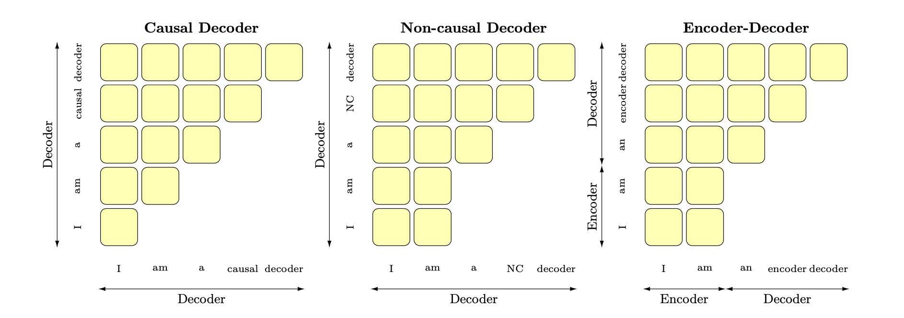

### 1.目前主流的语言模型体系有哪些？

目前主流的LLM模型体系包括以下几个：**GPT(OpenAI)**，**LLaMA(Meta)**，**BERT(Google)**，**XLNet(Google Brain)**， **RoBERTa(Facebook)**，**T5(Google)** 等。

### 2.Prefix LM 和 Causal LM 区别是什么？

Prefix LM（前缀语言模型）和 Causal LM（因果语言模型）是两种不同类型的语言模型，它们的区别在于生成文本的方式。

1. **Prefix LM**：前缀语言其实是 **Encoder-Decoder 模型的变体**，只不过 Encoder 和 Decoder **共享一个 Transformer**。它在前缀序列中任意两个 token 都相互可见，而 Decoder 部分采用 Auto Regressive 模式。待生成的 token 可以同时看到 Encoder 侧所有 token 和 Decoder 侧已经生成的 token。Prefix LM 的代表模型有 UniLM、GLM（适合 seq2seq 任务）。
2. **Causal LM**：因果语言模型是一种自回归模型，一般是 Decoder-Only 架构，只能根据之前的文本生成后续的文本。

总结来说，**前缀语言模型可以根据给定的前缀生成后续的文本，而因果语言模型只能根据之前的文本生成后续的文本。**它们的训练目标和生成方式略有不同，适用于不同的任务和应用场景。下面的图很形象地解释了二者的 Attention Mask 机制(左)及流转过程(右)。

### 3.大模型 LLM 的训练目标是什么？

LLM 的训练目标通常是**最大化似然估计（Maximum Likelihood Estimation，MLE），**即**最大化模型生成训练数据中观察到的文本序列的概率**。具体来说，对于每个文本序列，模型根据前面的上下文生成下一个词的条件概率分布，并通过最大化生成的词序列的概率来优化模型参数。

### 4.涌现能力是啥原因？

[[大语言模型的涌现能力：现象与解释 - 知乎 (zhihu.com)](https://zhuanlan.zhihu.com/p/621438653 "大语言模型的涌现能力：现象与解释 - 知乎 (zhihu.com)")] 涌现能力（Emergent Ability）是指**在训练过程中模型能力的突然提升**。这种能力使得模型能够超出其训练数据所提供的内容，并产生出具有创造性和独特性的输出。尽管涌现能力为模型带来了创造性和独特性，但也需要注意其生成的内容可能存在偏差、错误或不完整性。涌现能力的产生可以归因于以下几个原因：

1. **任务的评价指标不够平滑**：实际上**模型的能力一直在提升** ，只是评价体系过于严格让这段提升“不可见”；可以把问题形式换成更宽松的多选题。
2. **任务过于复杂**：目标任务由多个子任务构成。子任务效果随着模型增大符合 Scaling Law，而最终任务则体现为涌现现象。
3. **顿悟 (Grokking)**：对于某个任务，当逐步增加预训练数据的时候，与任务相关的有效数据量终于达到了最小要求临界点，于是看到了模型对这个任务产生了顿悟导致涌现。

### 5.为何现在的大模型大部分是 Decoder-only 结构？

1. Decoder-only 采用自回归训练，更适合生成式任务；
2. Decoder-only 支持复用 KV-Cache，对多轮对话更友好，推理效率更高；
3. Decoder-only 模型在没有任何微调的情况下 zero-shot 表现更好；
4. Encoder 的双向注意力会存在低秩问题，可能会削弱生成式模型的表达能力。

### 6.大模型架构介绍

Transformer 模型一开始是用来做 seq2seq 任务的，所以它包含 Encoder 和 Decoder 两个部分；他们两者的区别主要是，**Encoder 中每个 token 都能够看到整个序列中所有的信息**；而 **Decoder 中的 token 只能看到自身和它之前的文本信息**。概述几种主要的架构:以 BERT 为代表的 **encoder-only**、以 T5 和 BART 为代表的 **encoder-decoder**、以 GPT 为代表的 **decoder-only**、以 UNILM9 为代表的 **prefix LM**。

### 7.什么情况用 Bert 模型，什么情况用 LLaMA、ChatGLM 类大模型？

1. **Bert 模型**：Bert 为 **Encoder-only 架构**，更适合于 NLU (自然语言理解，侧重理解而非生成) 相关的任务，比如各种通用自然语言处理任务，如文本分类、命名实体识别、语义相似度计算等。
2. **LLaMA 模型**：LLaMA 为 **Decoder-only 架构**，更适合生成式任务，具有较强的推理能力。训练预料主要为以英语为主的拉丁语系，不包含中日韩文。
3. **ChatGLM 模型**：ChatGLM 为 **Prefix-decoder 架构**，是一个面向对话生成的语言模型，适用于构建聊天机器人、智能客服等对话系统。训练语料为中英双语。
4. 在选择模型时，还需要考虑**数据可用性、计算资源、预训练和微调**等因素。

### 8.LLMs 复读机问题

#### 8.1 什么是 LLMs 复读机问题？

LLMs复读机问题（LLMs Parroting Problem）是指大型语言模型在生成文本时过度依赖输入文本的复制，而缺乏创造性和独特性。当面对一个问题或指令时，模型可能会简单地复制输入文本的一部分或全部内容，并将其作为生成的输出，而不是提供有意义或新颖的回应。

#### 8.2 为什么会出现 LLMs 复读机问题？

1. **数据偏差且缺乏多样性**：训练数据中存在大量的重复文本，某些特定的句子或短语出现频率较高；或者训练数据中缺乏多样性的语言表达和语境。
2. **训练目标限制**：无监督、自回归的训练模式可能使得模型更倾向于生成与前文相似的文本。
3. **模型结构和参数设置**：大型语言模型的结构和参数设置也可能对复读机问题产生影响。

#### 8.3 如何缓解 LLMs 复读机问题？

1. **多样性训练数据**：在训练阶段，使用多样性的语料库来训练模型，避免数据偏差和重复文本的问题。
2. **引入噪声**：通过在生成过程中对模型的输出进行采样或添加随机性来引入噪声。例如通过采样不同的词或短语，或者引入随机的变换操作，以增加生成文本的多样性。
3. **温度参数调整**：温度参数是用来控制生成文本的多样性的一个参数。较高的温度值会增加随机性，从而减少复读机问题的出现。
4. **Beam 搜索调整**：Beam 搜索是一种常用的生成策略，它在生成过程中维护了一个候选序列的集合。通过调整 Beam 大小和搜索宽度，可以控制生成文本的多样性和创造性。
5. **后处理和过滤**：对生成的文本进行后处理和过滤，去除重复的句子或短语。
6. **人工干预和控制**：引入人工干预和控制机制，对生成的文本进行审查和筛选。

### 9.LLMs输入句子长度理论上可以无限长吗？

**理论上来说，LLMs（大型语言模型）可以处理任意长度的输入句子，但实际上存在一些限制和挑战**。下面是一些相关的考虑因素：

1. **计算资源**：句子太长可能会导致内存不足或计算时间过久。
2. **训练阶段**：处理长句子可能会导致梯度消失或梯度爆炸的问题，影响收敛效果。
3. **推理阶段**：生成长句子可能会增加模型的错误率和生成时间。

### 10.如何让大模型处理更长的文本？

1. **分块处理**：将长文本分割成较短的片段或元素进行处理。在处理分块文本时，可以使用相邻片段重叠的方式，以保持上下文的连贯性。
2. **结构优化**：可以增加模型的层数或参数量，以增加模型的表达能力。还可以使用更高效的模型架构，如 Decoder-only 以提高长文本的处理效率。
3. **算法优化**：采用 KV-Cache 复用、flash-attention 等方式降低计算成本，提高推理效率；训练/微调时，可以考虑使用更高效的 PEFT 算法。

### 11.各个专业领域是否需要各自的大模型来服务？

1. **领域特定知识/语言风格和惯用语**：不同领域拥有各自特定的知识和术语，需要针对该领域进行训练的大模型才能更好地理解和处理相关文本。
2. **领域需求的差异**：不同领域对于文本处理的需求也有所差异。因此，为了更好地满足不同领域的需求，需要专门针对各个领域进行训练或微调的大模型。
