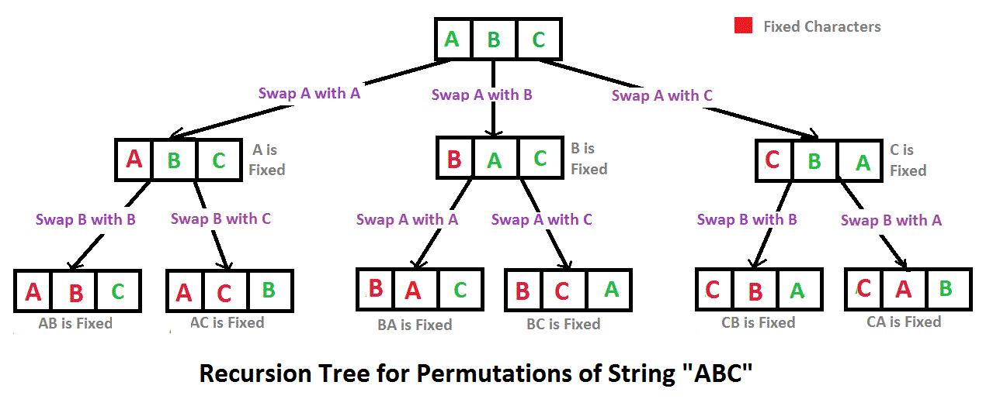
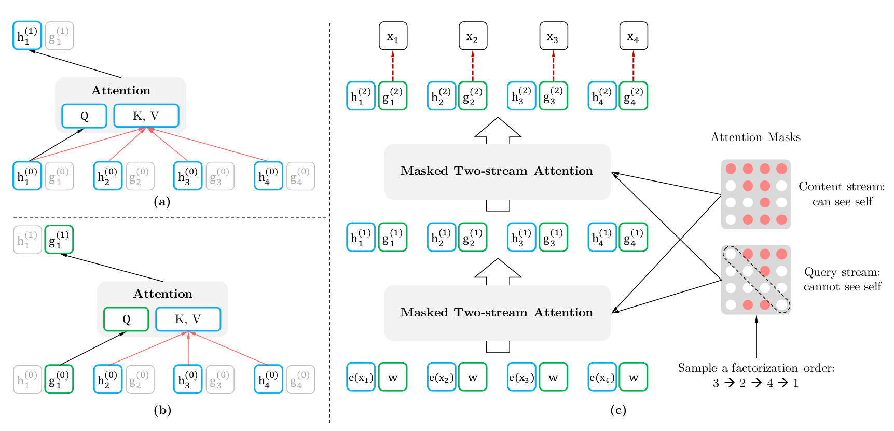

# 1. 模型结构与细节

BERT（Bidirectional Encoder Representations from Transformers）是谷歌提出 **encoder-only** 架构模型，作为一个 Word2Vec 的替代者。在 NLU 任务上效果很好，但是不适合处理生成任务（NLG）。论文的主要特点以下几点：

1. **使用了双向 Transformer 作为算法的主要框架（即 encoder-only）**：之前的模型是从左向右输入一个文本序列，或者将 left-to-right 和 right-to-left 的训练结合起来，实验的结果表明，双向训练的语言模型对语境的理解会比单向的语言模型更深刻；
2. 使用了 Mask Language Model (**MLM**) 和 Next Sentence Prediction (**NSP**) 的多任务训练目标；
3. 使用更强大的机器训练**更大规模的数据**，使 BERT 的结果达到了全新的高度。

## 1.1 两个任务

### Masked LM (MLM)

在将单词序列输入给 BERT 之前，每个序列中有 15％ 的单词被 `[MASK]` token 替换。 然后模型尝试基于序列中其他未被 mask 的单词的上下文来预测被掩盖的原单词。在训练模型时，一个句子会被多次喂到模型中用于参数学习，但是在确定要 Mask 掉的单词之后，这些词只有 80% 的概率会直接替换为`[Mask]`，还有 10% 的概率将会被替换为其它任意单词，10% 的概率会被保留原始 Token。

**MLM 任务对于在数据中随机选择 15% 的标记，其中 80% 换为`[Mask]`，10% 不变，10% 随机替换其他单词，原因是什么？**

典型的 Denosing Autoencoder (DAE) 的思路，**被 Mask 掉的单词就是在输入侧加入的噪音**。

1. **80% 的 mask tokens 替换为 `[MASK]`**：在不泄露 label 的情况下融合真双向语义信息；
2. **10% 的 mask tokens 替换为随机 token + 10% 的 mask tokens 保持不变**：使得模型在预测一个词汇时，不知道输入对应位置的词汇是否正确，迫使其尽量在每一个词上都学习到一个全局语境下的表征，并且赋予了模型一定的纠错和泛化能力。

这么做的缺点：

1. `[MASK]`标记只出现在预训练任务中，下游任务微调时不会出现，造成预训练和微调之间的不匹配。
2. 相较于传统语言模型，BERT 的每批次训练数据中只有 15% 的标记被预测，导致模型需要更多的训练步骤来收敛。

### Next Sentence Prediction (NSP)

在 BERT 的训练过程中，模型接收成对的句子作为输入，并且预测其中第二个句子是否是第一句后续的句子。在第一个句子的开头插入 `[CLS]` 标记，表示该特征用于分类模型，在每个句子的末尾插入 `[SEP]` 标记，表示分句符号，用于断开输入语料中的两个句子：(`[CLS]`这是第一句话。`[SEP]`这是第二句话。)；在训练期间，50％ 的输入对在原始文档中是前后关系，另外 50％ 中是从语料库中随机组成的，并且是与第一句断开的。

## 1.2 Embedding

BERT 的输入是一个经过任务编码后的文本（`[CLS]`A`[SEP]`B），Embedding 层执行如下操作：

1. **`Token Embedding`**：词嵌入，将每个 token 转换为 768 维向量表示形式；
2. **`Segment Embedding`**：用于区分输入句子的位置关系。初始化两个随机向量，第一个向量 $E_A$ 分配给属于第一个句子 A 的所有 tokens，第二个向量 $E_B$ 分配给属于第二个句子 B 的所有 tokens；
3. **`Position Embedding`**：和 Transformer 的三角函数编码不同，BERT 直接给每个位置词一个随机初始化的词向量，再对其进行训练。

BERT 的输出是输入各字对应的融合全文语义信息后的向量表示。

**BERT 和 Transformer Encoder 的差异有哪些？**
BERT 的 Embeddings 层比 Transformer Encoder 端多了`Segment Embeddings`；同时`Position Embedding`是通过训练得到的。加入`Segment Embeddings`的原因是 BERT 会处理句对分类、问答等任务，这里出现的句对是有先后关系的。

## 1.3 BERT 损失函数

BERT 损失函数组成：第一部分是来自 Mask-LM 的单词级别分类任务；另一部分是句子级别的分类任务；通过这两个任务的联合学习，可以使得 BERT 学习到的表征既有 token 级别信息，同时也包含了句子级别的语义信息。

$$
L\left(\theta, \theta_{1}, \theta_{2}\right)=L_{1}\left(\theta, \theta_{1}\right)+L_{2}\left(\theta, \theta_{2}\right)
$$

- $\theta$ 是 BERT 中 Encoder 部分的参数；
- $\theta_{1}$ 是 Mask-LM 任务中在 Encoder 上所接的输出层中的参数；
- $\theta_{2}$ 是句子预测任务中在 Encoder 接上的分类器参数；

在第一部分的损失函数中，记被 mask 的词集合为 $M$，词典为 $V$，模型在对应位置上的输出为一个对该位置上被 mask 的 token 的概率分布 $p(X=m\ ; \ \theta, \theta_{1})$，$m\in V$，所用的损失函数为负对数似然函数

$$
L_{1}\left(\theta, \theta_{1}\right)=-\sum_{m\in M} \log p\left(X=m\  ; \ \theta, \theta_{1}\right)
$$

在第二部分的损失函数中，记 token 数为 $N$，模型在每一个 token 位置输出一个该位置是否属于第二个句子的概率分布 $p(Y=n\ ; \ \theta, \theta_{2})$，$n\in \{0, 1\}$。所用的损失函数也是一个负对数似然函数

$$
L_{2}\left(\theta, \theta_{2}\right)=-\sum_{j=1}^{N} \log p\left(Y=n_{i} \ ;\ \theta, \theta_{2}\right)
$$

## 1.4 BERT 的优缺点

**BERT 优点**

1. Transformer Encoder 因为有 Self-attention 机制，因此 BERT 自带双向功能；
2. 加入了 Next Sentence Prediction 训练，获取了比词更高级别的句子级别的语义表征；
3. 设计了更通用的输入层和输出层，能够适配多类下游任务。

**BERT 缺点**

1. `[MASK]`标记在实际预测和下游微调时都中不会出现，训练时用过多`[MASK]`影响模型表现；
2. **被 mask 掉的单词之间可能有关系**。但由于 BERT 预训练的语料是海量的，所以靠其它例子也能弥补被 mask 单词之间的相互关系；
3. 在预训练的时候可能出现**只 mask 一个词的一部分**的情况，这样它只需要记住一些特殊词组就可以完成预测；
4. 每个 batch 只有 15% 的 token 被预测，所以 BERT 收敛得更慢；
5. 受 encoder 的双向功能影响，必须使用 Cloze（完形填空）的模式来完成 token 级别预训练。

## 1.5 BERT 与其他模型相比

**一些经常被用来对比的模型？**

- **RNN/LSTM**：不能并行计算，同时特征提取能力也不如 BERT 使用的 Transformer Encoder。

- **word2vec/CBOW**：word2vec 是一个轻量的词嵌入神经网络，根据训练方法的不同分为 CBOW 和 Skip-gram 模型；
  - word2vec 每个单词的 embedding 是唯一的，并不能很好地**处理一词多义的问题**，但 BERT 每个输出的 word embedding 都融合了上下文信息；
  - BERT 完形填空的训练模式很大程度上来源于 CBOW 模型；
  - BERT **得到的词向量做下游任务准确率也比 word2vec 更高**。

- **ELMo**：在 word2vec 的基础上对每个输出的词向量都考虑了上下文，为多义词的嵌入提出了一个较好的解决方案。对比 BERT，ELMo 是**伪双向**，只是将左到右，右到左的信息加起来。而且用的是 lstm，缺点也是显而易见的，模型参数太多，少量数据训练时，容易过拟合。
  
**BERT 的训练相对于 CBOW 有什么不同点？**

1. CBOW 中每个单词都会成为 input word，而 BERT 不这么做因为训练成本太高。
2. CBOW 中的输入数据只有待预测单词的上下文，而 BERT 的输入是带有`[MASK]`的完整句子。

**BERT，GPT，ELMo 之间的不同点？**

- **关于特征提取器：**`ELMo`采用 LSTM 进行特征提取，提取特征的能力有限。`GPT`和`BERT`采用**Transformer**进行特征提取：其中`BERT`采用`Encoder`模块；`GPT`采用`Decoder`模块。
- **单/双向语言模型：** `GPT`采用**单向语言模型**；`ELMo`采用左右两个单向语言模型分别提取特征然后拼接的**伪双向**；`BERT`采用**双向语言模型**，且特征融合能力比`ELMo`的伪双向效果更好。

**BERT，GPT，ELMo 各自的优缺点？**

- **ELMo**：可以解决早期 Word2Vec 模型无法处理的多义词问题，但是 LSTM 提取特征的能力弱于 Transformer。
- **GPT**：使用了 Transformer 提取特征和 Decoder-only 架构, 使得模型能力大幅提升且更适合生成式任务，但是无法融合未来的信息。
- **BERT**：使用双向 Transformer 提取特征，使得模型能力大幅提升，但是**模型训练效率太低**，需要的数据和算力要求过高，且更适用于语言理解方面的任务，不适合用于生成式任务。

# 2. BERT 变种

## 2.1 [RoBERTa](https://arxiv.org/pdf/1907.11692.pdf)

全称 Robustly optimized BERT approach，在 BERT 的基础上做了一些改进，使模型得到更充分的预训练。改进共有五个方面：

- **使用更大的 batch-size**；
- **使用更长的 sequence**；
- **移除 NSP 任务：实验结果表明，不使用 NSP 的效果要优于使用 NSP**；
- **将静态 mask 机制改为动态 mask 机制**；
- **tokenize 使用与 GPT-2 相同的 BPE 策略**。

## 2.2 [ALBERT](https://openreview.net/pdf?id=H1eA7AEtvS)
> 符号说明：将 embedding 层向量的维度定义为 `E`，将 transformer 层中向量的维度（模型维度）定义为 `H`，在 Bert 中 `E` 与 `H` 是相等的。

全称 A Lite BERT，目的是想搞一个比 Bert 更小、更轻量级的模型。这个模型相比于 Bert 在三个方面做了修改：
- **减小 Embedding 层的维度**：令`E << H`，得到嵌入向量之后再通过一个`E * H`维矩阵回到原维度。改进导致前后 embedding 层的参数量从约 16M 降到约 2.8M。作者认为`E` 与 `H`两者没必要相同，原因有二：
  - **模型不同层学到的信息不同**。作者认为靠近输入的 embedding 层学到的是语法信息，而离输入较远的 transformer 层学到才是更复杂的包含上下文的语义信息。从这个角度来说应该 `E << H`；
  - **embedding 的参数量在整个模型中占比较高，而在训练时更新的又比较稀疏。**
- **跨层参数共享**：所有的 transformer 层共享相同参数，也就是说实际上只有一个 transformer 层的权重。
- **将 NSP 任务换成了 SOP 任务 (sentence order prediction)**：作者认为 NSP 任务之所以没有作用是因为太简单，所以在其基础上设计了一个难度更高的新任务。**SOP 任务就是预测两句话有没有被交换过顺序**。

## 2.3 [SpanBERT](https://arxiv.org/pdf/1907.10529)

SpanBERT 是提出对 BERT 进行的一些简单修正，主要在两个方面进行改进：
- **将 token mask 改成 span mask**：不采用随机 mask 单个 token 的方法，而是 mask 随机长度（几何分布）的连续 token (span)。
- **去掉 NSP 并增加边界预测任务 SBO**：序列 $X=\left(x_{1}, \ldots x_{n}\right)$，有被 mask 的连续 span $y_i=\left(x_{s}, \ldots, x_{e}\right)$，其中 $s$ 和 $e$ 分别代表开始和结尾。边界预测 SBO 表示为预测 $\hat{y}_{i}=f\left(x_{s-1}, x_{e+1}, p_{i}\right)$ 论文中 f 的实现用的是两层带 GeLU 激活函数的全连接网络。
  

# 3. XLNet

XLNet 是由 CMU 和 Google Brain 联合提出的一种算法，沿用了自回归语言模型 AR，并利用排列语言 PLM 模型合并了 Bert (AE) 的优点，同时集成 transformer-xl 对于长句子的处理，达到了 SOTA 的效果；XLNet 更接近 decoder-only 但具备双向感知能力。

## 3.1 AR 和 AE

- **AR (Autoregressive Language Modeling)** 指的是依据之前的 tokens 来预测当前时刻的 token。AR 的缺点是无法同时利用上下文的信息，不适合 NLU 任务；优点是适合 NLP 任务。
$$
\max _{\theta} \sum_{t=1}^{T} \log p_{\theta}\left(x_{t} \mid \mathbf{x}_{<t}\right)
$$

- **AE (Autoencoding Language Modeling)** 指的是像 BERT 一样根据上下文恢复出原始值。AE 的缺点主要是由引入`[Mask]`标记导致的预训练和微调不一致的问题；优点是能比较自然地融入双向语言模型，适合 NLU 任务。
$$
\max _{\theta} \sum_{t=1}^{T} \mathbb{I}_{\mathrm{masked}}(x_t)\cdot \log p_{\theta}\left(x_{t} \mid {\hat{\mathbf{x}}}\right)
$$

XLNet 的出发点就是：能否融合 AR 和 AE 两者的优点。具体来说，**站在 AR 的角度，如何引入和双向语言模型等价的效果**。

## 3.2 排列语言模型（Permutation LM）

作者发现，只要在 AR 中再加入一个步骤，就能够完美地将 AR 与 AE 的优点统一起来，那就是提出**Permutation Language Model**。具体实现方式
- **随机取序列的一种排列**
- **将末尾一定量的词遮掩**
- **用 AR 的方式预测被遮掩的词**

<table>
    <tr>
        <td>
          
        </td>
        <td>
        </td>
        <td>
          
    </tr>
</table>

论文中 Permutation 具体的实现方式是通过直接对 Transformer 的 Attention Mask 进行操作。比如说序号依次为 1234 的句子，先随机取一种排列3241。于是根据这个排列就做出类似下图的 Attention Mask。先看第1行，因为在新的排列方式中 1 在最后一个，根据从左到右 AR 方式，1 就能看到 234 全部，于是第一行的 234 位置是红色的，以此类推。第2行，因为 2 在新排列是第二个，只能看到 3，于是 3 位置是红色。第 3 行，因为 3 在第一个，看不到其他位置，所以全部遮盖掉...

这里 XLNet 还使用了部分预测（Partial Prediction）的方法。因为 LM 是从第一个 Token 预测到最后一个 Token，在预测的起始阶段，上文信息很少而不足以支持 Token 的预测，这样可能会对分布产生误导，从而使得模型收敛变慢。为此，XLNet 只预测后面一部分的 Token，而把前面的所有 Token 都当作上下文。具体来说，对长度为 T 的句子，我们选取一个超参数 K，使得后面`1/K`的 Token 用来预测，前面 `1-1/K` 的 Token 用作上下文。注意，`K`越大，上下文越多，模型预测就越精确。

## 3.3 Two-Stream Self-Attention

在上面的方法中，首先我们会发现，打乱顺序后**位置信息**，也就是被预测的词在原来序列中的位置，非常重要；但同时对每个位置来说，需要预测的是对应位置上**内容信息**，于是输入就**不能包含内容信息**，不然模型学不到东西，只需要直接从输入复制到输出就好了。

这里有一个问题，因为在传统模型中，**位置信息与内容信息是耦合在一起的**，排列操作造成了**位置信息与内容信息的割裂**，因此在 BERT 这样的位置信息加内容信息输入 Self-Attention 的流之外，作者还增加了另一个**只有位置信息作为 Self-Attention 中 query 输入的流**。文中将前者称为 **Content Stream**，而后者称为 **Query Stream**。

这样就能利用 Query Stream 在对需要预测位置进行预测的同时，又不会泄露当前位置的内容信息。具体操作就是用两组隐状态`g`和`ℎ`。其中`g`只有位置信息，作为 Self-Attention 里的 Q 。`ℎ`包含内容信息，则作为 K 和 V。具体表示如下图 (a) 所示：

上图中我们需要理解三点：

- 第一点，图 (c) 最下面一层蓝色的 Content Stream 的输入是 $x$ 对应的词向量，不同词对应不同向量。旁边绿色的 Query Stream 都是一样的 $w$ 这个和 Relative Positional Encoding 有关。
- 第二点，模型在训练阶段的**预测**时，实际上只使用了 Query Stream。Content Stream 存在的意义是为 Query Stream 提供必需的`ℎ`的计算。
- 第三点，模型在**推理**时，只用 Content Stream。

## 3.4 Transformer-XL

对于过长序列，如果分段处理往往会遗漏信息导致效果会下降，XLNet 借鉴了 Transformer-XL 的思想，设置一个保留上一个片段的信息，在训练时进行更新。

# 4. BERT 面试题集合
**4.1 BERT 用字粒度和词粒度的优缺点有哪些？** 
字粒度（Character-level）能**更好地处理未登录词（OOV）**，灵活度高；缺点是会导致**输入序列长度增加**；同时需要更多的训练数据，否则可能会导致过拟合。

相反，词粒度（Word-level）**计算效率高**，对于高频词和常见词能学到更稳定表示；但**无法处理未登录词**。对于多音字等形态复杂的词汇，可能无法准确捕捉其细粒度的信息。

**4.2 为什么 BERT 选择 mask 掉 15% 这个比例的词？** 
15% 是由 BERT 的作者在原始论文中提出，并有实验验证的一种经验性比例。

**4.3 BERT 非线性的来源在哪里？** 
主要来自前馈层的 **gelu** 激活函数和 self-attention 中的 **softmax** 操作。
#######################################################
**4.3 为什么 BERT 在第一句前会加一个 [CLS] 标志?**
BERT 在第一句前会加一个 [CLS] 标志，**最后一层该位对应向量可以作为整句话的语义表示，从而用于下游的分类任务等**。为什么选它？因为与文本中已有的其它词相比，这个无明显语义信息的符号会更“公平”地融合文本中各个词的语义信息，从而更好的表示整句话的语义。

具体来说，self-attention是用文本中的其它词来增强目标词的语义表示，但是目标词本身的语义还是会占主要部分的，因此，经过BERT的12层，每次词的embedding融合了所有词的信息，可以去更好的表示自己的语义。而 [CLS] 位本身没有语义，经过12层，得到的是attention后所有词的加权平均，相比其他正常词，可以更好的表征句子语义。

**4.5 BERT训练时使用的学习率 warm-up 策略是怎样的？为什么要这么做？**

在BERT的训练中，使用了学习率warm-up策略，这是**为了在训练的早期阶段增加学习率，以提高训练的稳定性和加快模型收敛**。

学习率warm-up策略的具体做法是，在训练开始的若干个步骤（通常是一小部分训练数据的迭代次数）内，**将学习率逐渐从一个较小的初始值增加到预定的最大学习率**。在这个过程中，学习率的变化是线性的，即学习率在warm-up阶段的每个步骤按固定的步幅逐渐增加。学习率warm-up的目的是为了解决BERT在训练初期的两个问题：

- **不稳定性**：在训练初期，由于模型参数的随机初始化以及模型的复杂性，模型可能处于一个较不稳定的状态。此时使用较大的学习率可能导致模型的参数变动太大，使得模型很难收敛，学习率warm-up可以在这个阶段将学习率保持较小，提高模型训练的稳定性。
- **避免过拟合**：BERT模型往往需要较长的训练时间来获得高质量的表示。如果在训练的早期阶段就使用较大的学习率，可能会导致模型在训练初期就过度拟合训练数据，降低模型的泛化能力。通过学习率warm-up，在训练初期使用较小的学习率，可以避免过度拟合，等模型逐渐稳定后再使用较大的学习率进行更快的收敛。

**4.6 在BERT应用中，如何解决长文本问题？**

在BERT应用中，处理长文本问题有以下几种常见的解决方案：

- **截断与填充**：将长文本截断为固定长度或者进行填充。BERT模型的输入是一个固定长度的序列，因此当输入的文本长度超过模型的最大输入长度时，需要进行截断或者填充。通常，可以根据任务的要求，选择适当的最大长度，并对文本进行截断或者填充，使其满足模型输入的要求。
- **Sliding Window**：将长文本分成多个短文本，然后分别输入BERT模型。这种方法被称为Sliding Window技术。具体来说，将长文本按照固定的步长切分成多个片段，然后分别输入BERT模型进行处理。每个片段的输出可以进行进一步的汇总或者融合，得到最终的表示。
- **Hierarchical Model**：使用分层模型来处理长文本，其中底层模型用于处理短文本片段，然后将不同片段的表示进行汇总或者融合得到整个长文本的表示。这样的分层模型可以充分利用BERT模型的表示能力，同时处理长文本。
- **Longformer、BigBird等模型**：使用专门针对长文本的模型，如Longformer和BigBird。这些模型采用了不同的注意力机制，以处理超长序列，并且通常在处理长文本时具有更高的效率。
- **Document-Level Model**：将文本看作是一个整体，而不是将其拆分成句子或段落，然后输入BERT模型进行处理。这样的文档级模型可以更好地捕捉整个文档的上下文信息，但需要更多的计算资源。
- 
**4.7 BERT 的 mask 为何不学习 transformer 在 attention 处进行屏蔽 score 的技巧？**

- BERT和transformer的目标不一致，bert是语言的预训练模型，需要充分考虑上下文的关系，而transformer主要考虑句子中第i个元素与前i-1个元素的关系。